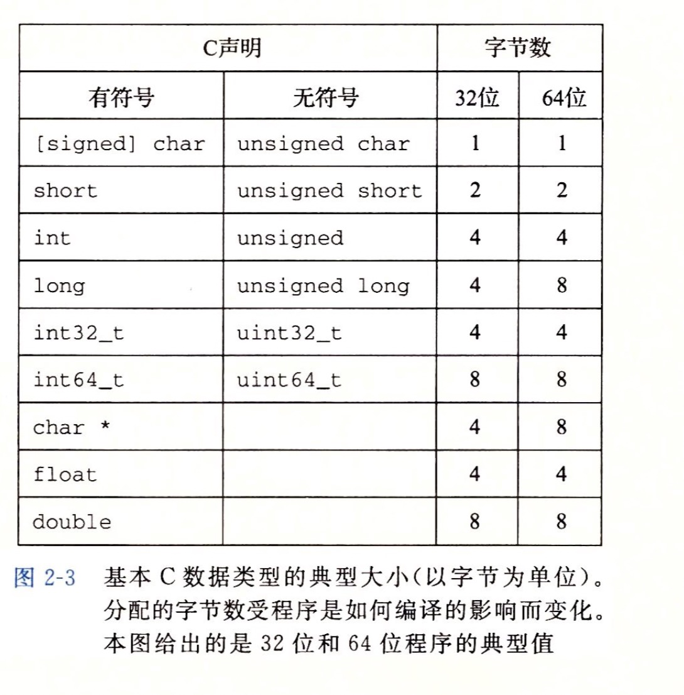

# 											第二章，信息的表示和处理 

> #### 本章主要讲了计算机如何表示数字和不同数据的表示方式,和计算机如何操作这些数字的属性

* ##### 大多数计算机使用的是快（字节  8个bit）最为最小的寻子单位，不是内存的单独的位。

* ##### 十六进制的表示法，十六进制和二进制的互相转化。二进制和十进制的互相转换。

* ##### 冯诺依曼模型中 CPU 负责控制和计算。为了方便计算较大的数值，CPU 每次可以计算多个字节的数据。

  * ###### 如果 CPU 每次可以计算 4 个 byte，那么我们称作 32 位 CPU；

  * ###### 如果 CPU 每次可以计算 8 个 byte，那么我们称作 64 位 CPU;

* ##### 寻址和字节的顺序

  * ##### 64 位 CPU 可以寻址更大的内存空间

    * 如果 32 位/64 位说的是程序，那么说的是指令是 64 位还是 32 位的。32 位指令在 64 位机器上执行，困难不大，可以兼容。 如果是 64 位指令，在 32 位机器上执行就困难了。因为 32 位指令在 64 位机器执行的时候，需要的是一套兼容机制；但是 64 位指令在 32 位机器上执行，32 位的寄存器都存不下指令的参数。

    * 操作系统也是一种程序，如果是 64 位操作系统，也就是操作系统中程序的指令都是 64 位指令，因此不能安装在 32 位机器上。

* ##### 字符串的表示

  >  以null 字符为结束，的字符数组。每个字符ASCII 码表示

  

* ##### 整数的表示，反码补码的使用（反码和补码的出现，是为了解决计算机的运算问题）。

* ##### 浮点数的表示，浮点数的运算。

