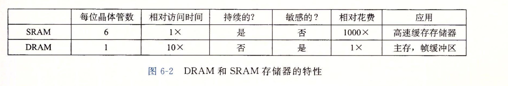
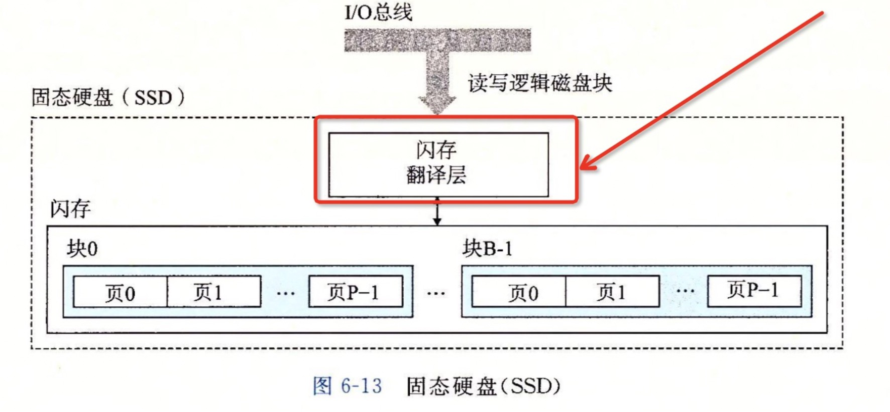
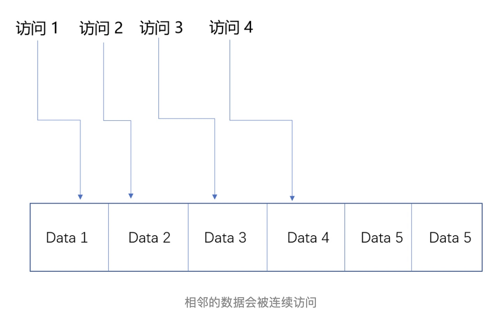
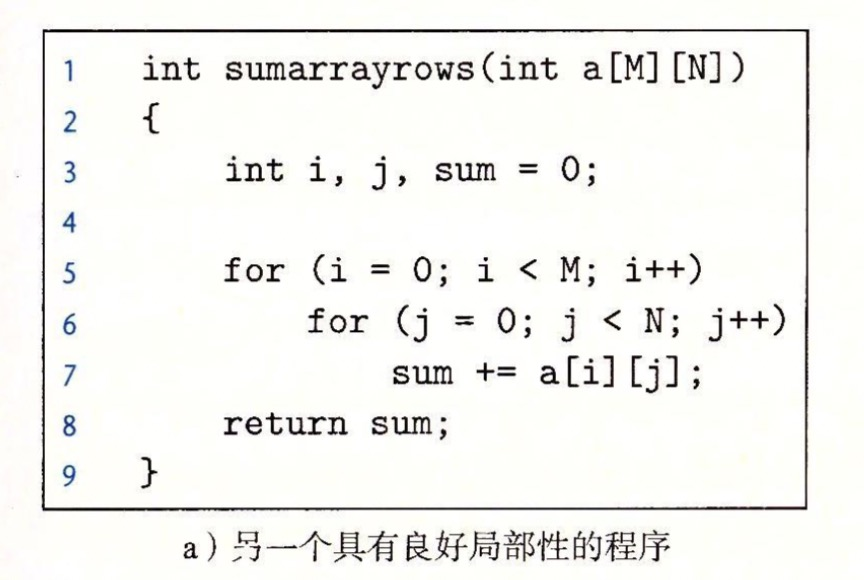
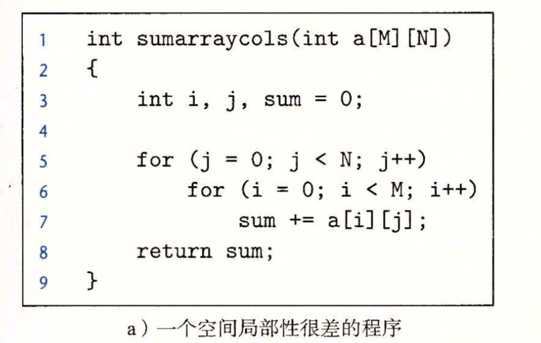
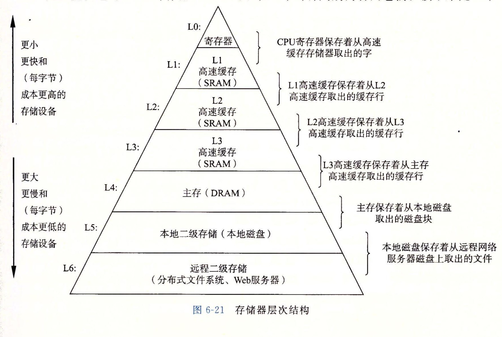

## 存储器的层次结构
#### 存储技术
* 随机存储器（Random Access Memory):1.SRAM   2.DRAM
    * SRAM(静态存储器)：快，贵，稳，用于芯片读写（高速缓存）；六个晶管电路,因为 SRAM 的电路简单，所以访问速度非常快，防干扰
    * DRAM(动态储存器)：比起 SRAM 来说，它的密度更高，有更大的容量，而且它也比 SRAM 芯片便宜不少。电容，易干扰，用于帧缓/主存
    

* 非易失性存储器（Read-Only Memory）：RAM在断电的时候会丢失数据，ROM不会（硬盘）

* 访问主存：数据流通过总线在处理器和DRAM 中间来回。

* 磁盘：磁盘的结构，以及磁盘的读写。

* 固态硬盘：加了一个闪存翻译层，（半导体存储器）代替传统的机械转动，反复写会磨损。
    

* 局部性：
    * 时间局部性，从时间维度上将东西关联起来，一部电视剧电视剧第一集第二集这种，有时间轴的那种。
     
    * 空间复杂度，从类似于空间的概念关联起来，比如说同类商品，竞品或者同一品牌的不同系列。
    

*分别从一个二维数组不同的读取方式

    从行依次读取：数组在内存中的行优先顺序被访问

   

    从列依次读取：内存数据访问的时候步长为N

   

* 存储器的结构图：

