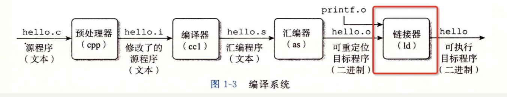

### 第七章，链接

#### 1.链接：是一个将代码和数据片段组合成一个单一文件（可以被加载到内存中执行）的过程。

* 编译时
* 加载时
* 运行时

#### 2.链接器的两主要任务：

* 符号解析
* 重定位

#### 3.目标文件：

* 可重定向目标文件：编译时候可以创建合并成一个可执行文件
* 可执行目标文件：可以直接被加载到内存执行
* 共享目标文件：运行时可以被动态加载

#### 4.链接可以分：

* 动:链接
* 静：静链接
* 共享:在动态链接的过程中，我们想要“链接”的，不是存储在硬盘上的目标文件代码，而是加载到内存中的共享库。

