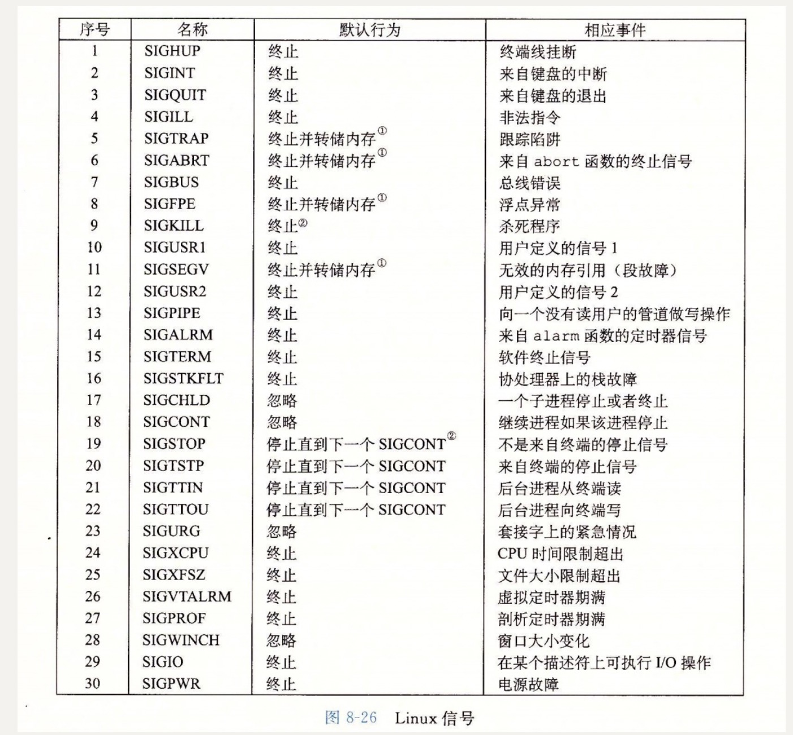

### 第八章，异常控制流

### 1.异常：异常是异常控制流的一种形式，它由硬件和操作系统实现。

>在任何情况下，处理器检测到有事件发生，会通过一张异常表，进行一个过程进程调用（异常处理程序）

#### 2.系统调用错误，通常返回 -1，并且设置全局整数变量来表示什么错误。

#### 3.子进程可以得到父进程用户级级虚拟地址空间相同的一个副本（数据/代码段/堆/共享库/用户栈，子进程还能获得父进程的任何打开文件描述符相同的副本（子进程可以读写父进程任意打开的文件）。

#### 4.子进程结束，内核将子进程退出状态传给父进程。

#### 5.Linux 的信号表

#### 6.Linux 提供了控制和操作进程的有效工具

* PS:列出当前的进程（包括僵尸进程）
* TOP: 打开关于当前进程资源的使用情况
* PMAP: 显示进程的内存映射情况
* STRACE:打印一个正在进行的进程和它的子进程调用的每个系统的调用轨迹

