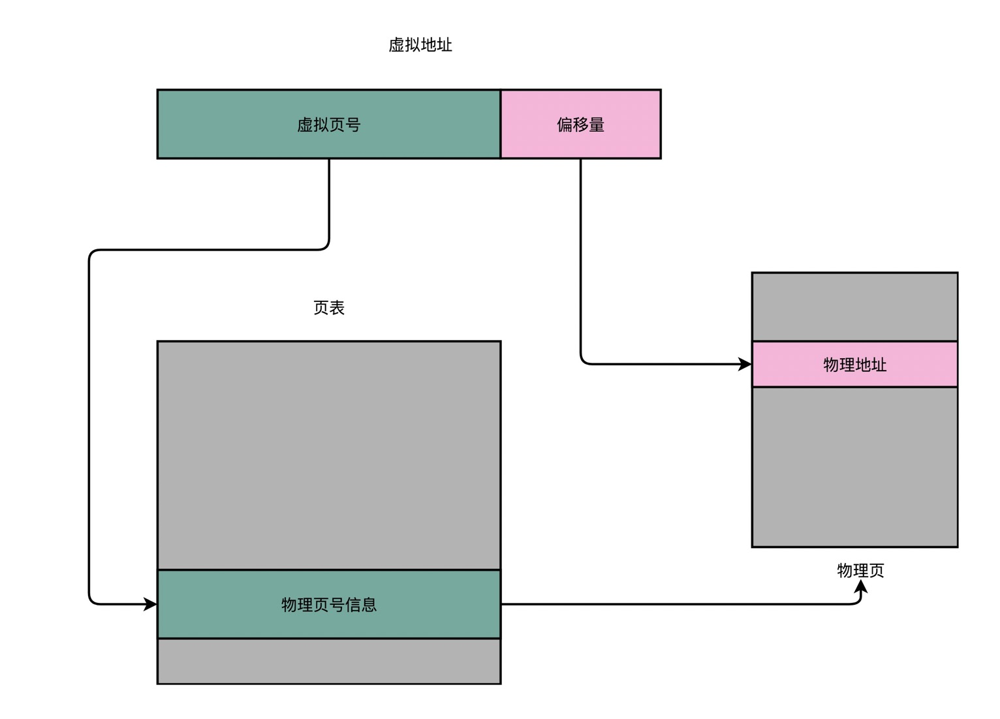
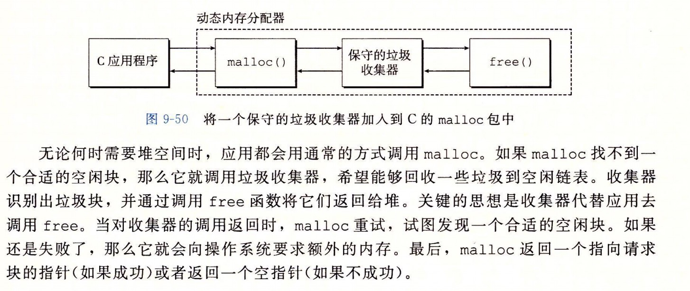

# 虚拟内存

#### 一，内存地址转换，其实就是这样三个步骤：
* 1.把虚拟内存地址，切分成页号和偏移量的组合；
* 2.从页表里面，查询出虚拟页号，对应的物理页号；
* 3.直接拿物理页号，加上前面的偏移量，就得到了物理内存地址;

> 我们的内存需要被分成固定大小的页（Page），然后再通过虚拟内存地址（Virtual Address）到物理内存地址（Physical Address）的地址转换（Address Translation），才能到达实际存放数据的物理内存位置。而我们的程序看到的内存地址，都是虚拟内存地址

#### 二，动态内存分配器维护着一个进程的虚拟内存区域称作堆。

#### 三，使用动态分配内存的原因是 有些数据结构是要在运行的时候才能知道空间的大小。

#### 四，垃圾回收

####五，操作系统为每个进程提供了一个独立的页表，以此来为每个进程提供一个独立的虚拟地址空间。因此每个进程都使用相同的内存映像格式。

####六，线程调度都有哪些方法？
>非抢占的先到先服务的模型是最朴素的，公平性和吞吐量可以保证。但是因为希望减少用户的平均等待时间，操作系统往往需要实现抢占。操作系统实现抢占，仍然希望有优先级，希望有最短任务优先。

#### 七，大多数系统使用物理寻址来访问SRAM高速缓存。高速缓存无需处理保护问题，因为访问权限的检查是地址翻译过程的一部分。
